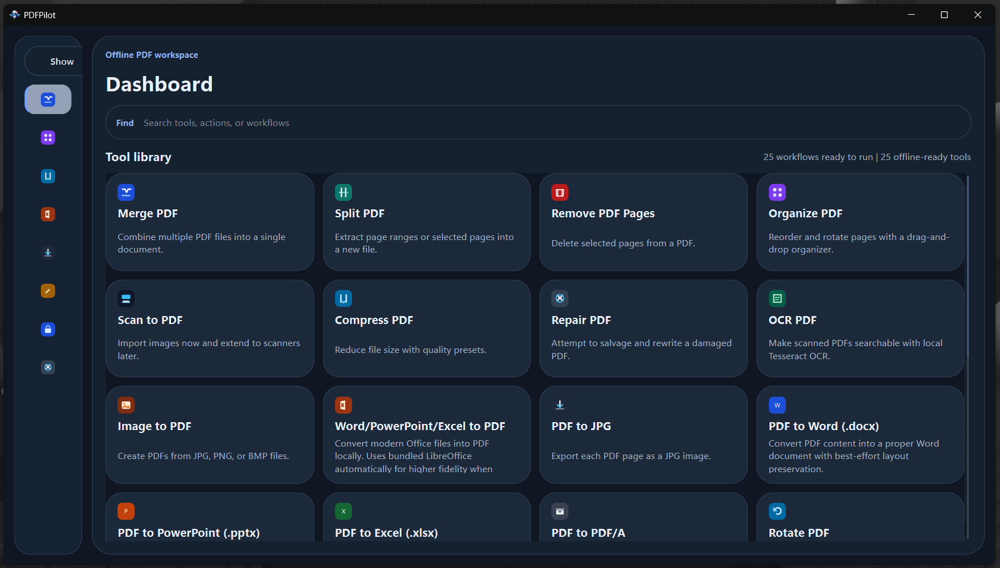
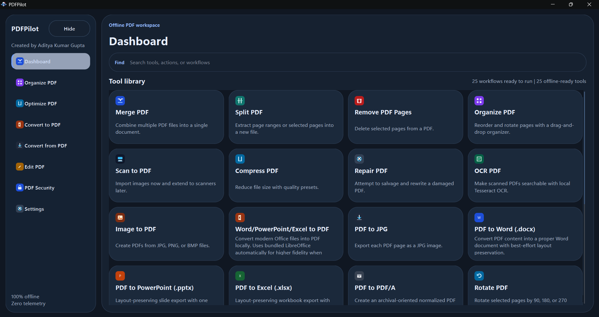
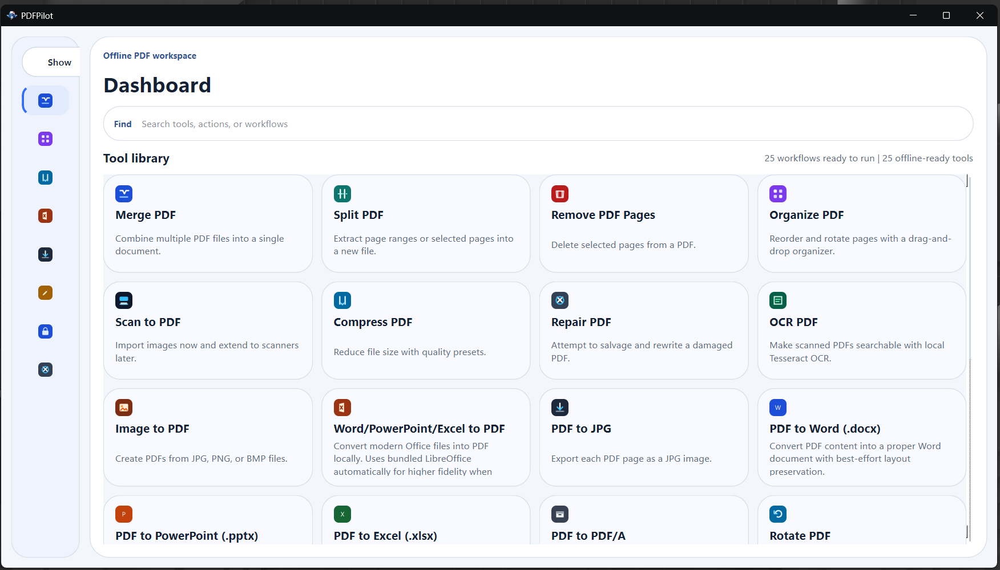
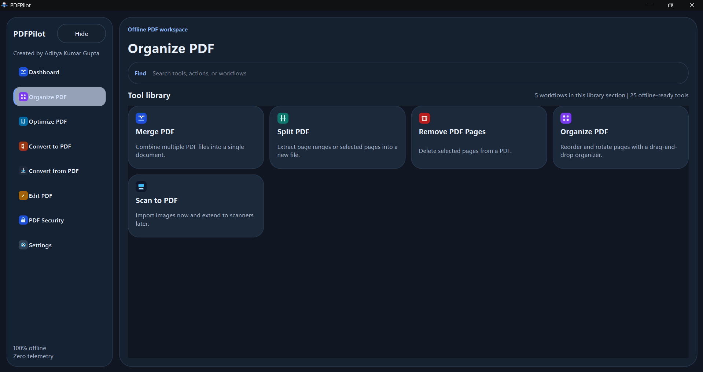
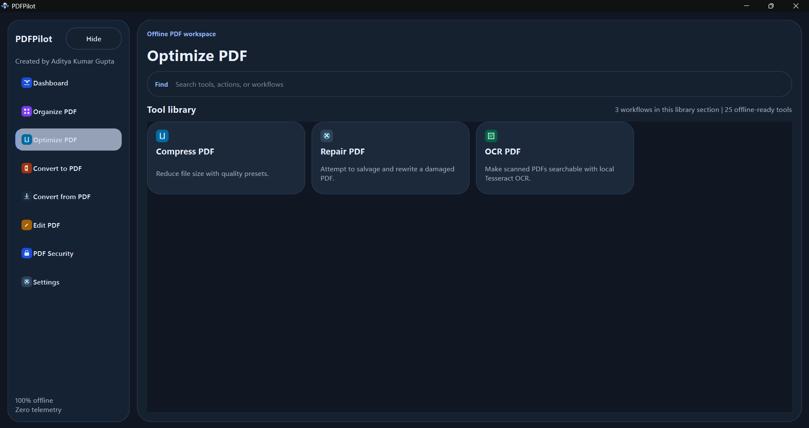
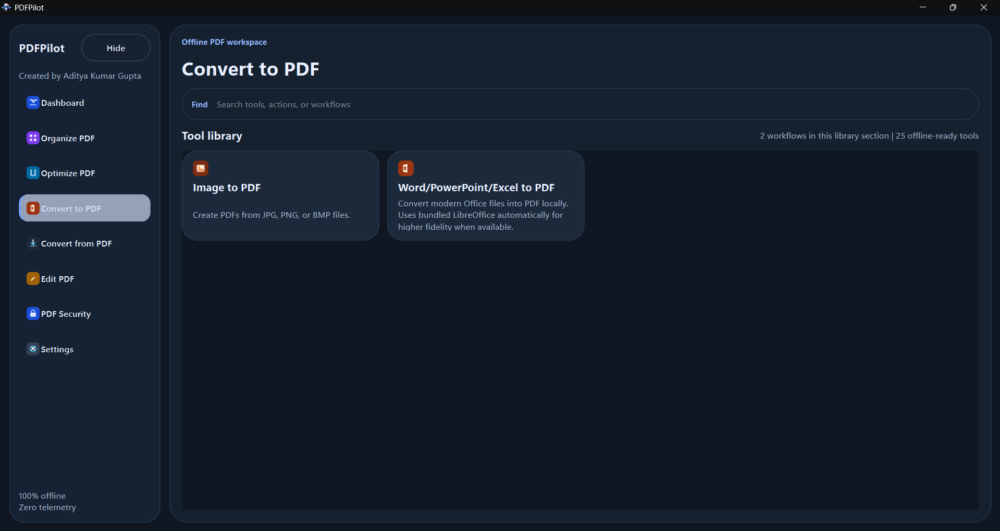
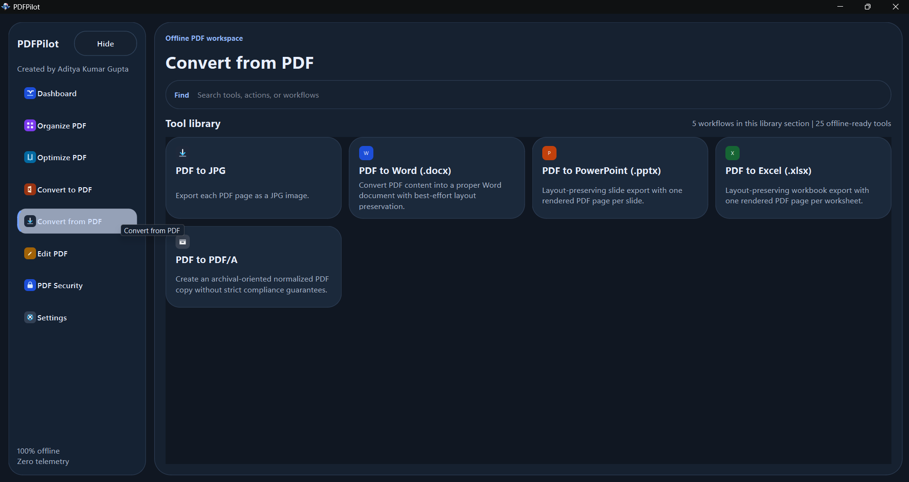
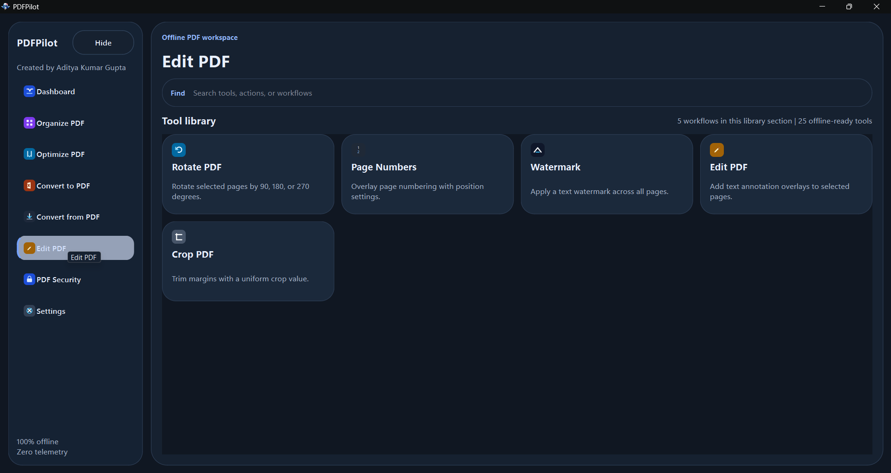
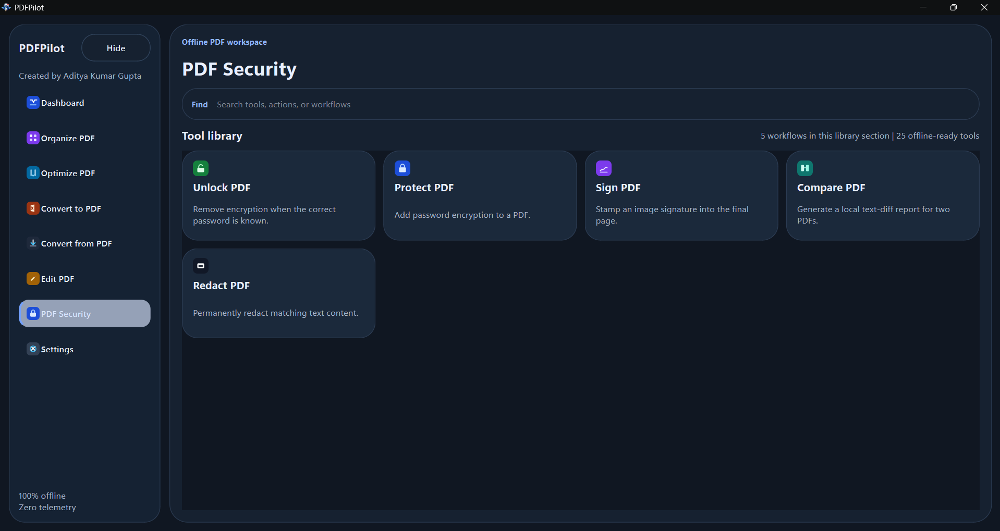
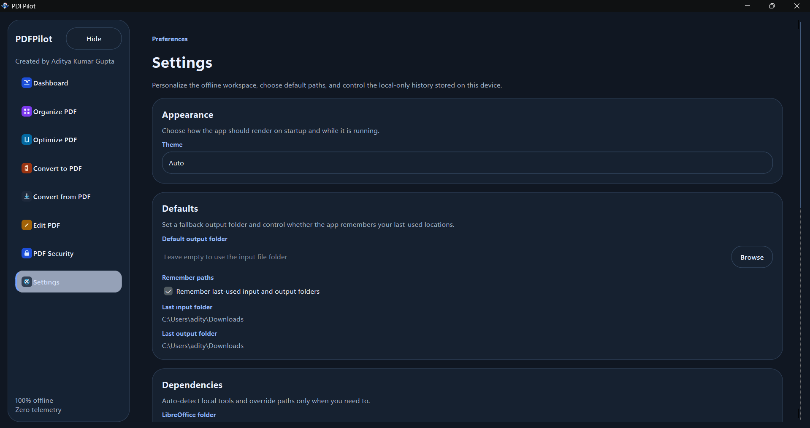

<div align="center">


# PDFPilot

**A private PDF command center for Windows.**

PDFPilot brings everyday PDF work into one fast, offline desktop app: merge, split, organize, compress, OCR, convert, watermark, protect, unlock, redact, compare, and export files without sending documents to the cloud.

[](https://github.com/Aaditya-Kumar-Gupta/PDFPilot/releases/latest)
[](https://github.com/Aaditya-Kumar-Gupta/PDFPilot/releases/latest)
[](#privacy-first)
[](LICENSE)
[](https://github.com/Aaditya-Kumar-Gupta/PDFPilot/stargazers)

[**Download**](https://github.com/Aaditya-Kumar-Gupta/PDFPilot/releases/latest) · [**Website**](https://aaditya-kumar-gupta.github.io/PDFPilot/) · [**Report a Bug**](https://github.com/Aaditya-Kumar-Gupta/PDFPilot/issues) · [**Request a Feature**](https://github.com/Aaditya-Kumar-Gupta/PDFPilot/issues)

<br />



</div>

---

## Why PDFPilot

PDF tools are usually scattered across websites, subscriptions, browser tabs, and upload boxes. PDFPilot keeps the workflow local: choose a tool, drop in files, run the job, and keep the output on your machine.

| Built For | What It Means |
|---|---|
| Private documents | Files are processed locally, not uploaded to a service |
| Daily PDF work | 25 offline-ready tools grouped into clear libraries |
| Windows desktops | Native desktop interface built with Python and PySide6 |
| Portable releases | Installer and MSIX-oriented release workflows |
| Real-world files | PDF, image, Office, OCR, archive, and security workflows |

---

## Screenshots

<div align="center">

| Dark Workspace | Light Workspace |
|---|---|
|  |  |

| Organize | Optimize |
|---|---|
|  |  |

| Convert To PDF | Convert From PDF |
|---|---|
|  |  |

| Edit | Security |
|---|---|
|  |  |

| Settings |
|---|
|  |

</div>

---

## Privacy First

| Question | Answer |
|---|---|
| Cloud uploads | Never |
| Telemetry | Zero |
| Tracking | None |
| Internet required | No |

PDFPilot runs locally using bundled and auto-detected desktop libraries. Your files stay on your machine, whether you are online, offline, or working in a restricted environment.

---

## Tool Library

### Organize PDF

| Tool | Description |
|---|---|
| Merge PDF | Combine multiple PDF files into a single document |
| Split PDF | Extract page ranges or selected pages into a new file |
| Remove PDF Pages | Delete selected pages from a PDF |
| Organize PDF | Reorder and rotate pages with a drag-and-drop organizer |
| Scan to PDF | Create PDFs from image files |

### Optimize PDF

| Tool | Description |
|---|---|
| Compress PDF | Reduce file size with quality presets |
| Repair PDF | Attempt to salvage and rewrite a damaged PDF |
| OCR PDF | Make scanned PDFs searchable with local Tesseract OCR |

### Convert to PDF

| Tool | Description |
|---|---|
| Image to PDF | Create PDFs from JPG, PNG, or BMP files |
| Word / PowerPoint / Excel to PDF | Convert Office files locally with LibreOffice when available |

### Convert from PDF

| Tool | Description |
|---|---|
| PDF to JPG | Export each PDF page as a JPG image |
| PDF to Word (.docx) | Convert PDF content into an editable Word document |
| PDF to PowerPoint (.pptx) | Create one rendered PDF page per slide |
| PDF to Excel (.xlsx) | Create one rendered PDF page per worksheet |
| PDF to PDF/A | Create an archival-oriented normalized PDF copy |

### Edit PDF

| Tool | Description |
|---|---|
| Rotate PDF | Rotate selected pages by 90, 180, or 270 degrees |
| Page Numbers | Add page numbers with position settings |
| Watermark | Apply a text watermark across all pages |
| Edit PDF | Add text annotation overlays to selected pages |
| Crop PDF | Trim margins with a uniform crop value |

### PDF Security

| Tool | Description |
|---|---|
| Protect PDF | Add password encryption to a PDF |
| Unlock PDF | Remove encryption when the correct password is known |
| Sign PDF | Stamp an image signature into the final page |
| Redact PDF | Permanently redact matching text content |
| Compare PDF | Generate a local text-diff report for two PDFs |

---

## Installation

### Windows Installer

1. Download `PDFPilot-Setup.exe` from [Releases](https://github.com/Aaditya-Kumar-Gupta/PDFPilot/releases/latest)
2. Run the installer
3. Launch PDFPilot

### Microsoft Store Package

A Store-oriented MSIX package is available in the release workflow. Microsoft Store distribution is planned separately.

### Requirements

- Windows 10 or Windows 11, 64-bit
- Tesseract OCR for OCR features, auto-detected or configured in Settings
- LibreOffice for higher-fidelity Office-to-PDF conversion, bundled in desktop builds when available

---

## Tech Stack

| Area | Technology |
|---|---|
| Desktop UI | Python, PySide6 / Qt |
| PDF processing | PyMuPDF, pypdf, pdfplumber, pdf2docx |
| Image processing | Pillow |
| Office export | LibreOffice, python-docx, python-pptx, openpyxl |
| OCR | Tesseract OCR via pytesseract |
| Packaging | PyInstaller, Inno Setup, MSIX tooling |

---

## Run from Source

```powershell
py -3.12 -m venv .venv
.venv\Scripts\Activate.ps1
python -m pip install --upgrade pip
pip install -r requirements.txt
.venv\Scripts\pythonw.exe main.pyw
```

Python 3.12 is the preferred target. The current workspace has also been validated with Python 3.14 and the pinned package versions in `requirements.txt`.

---

## Build

Create a Windows executable with PyInstaller:

```powershell
python -m PyInstaller --clean PDFPilot.spec
```

The packaged app is created in `dist\PDFPilot\`.

Build release artifacts:

```powershell
powershell -ExecutionPolicy Bypass -File .\scripts\build_release.ps1 -Flavor desktop -Version 1.0.0
powershell -ExecutionPolicy Bypass -File .\scripts\build_release.ps1 -Flavor store -Version 1.0.0.0 -PackageName PDFPilot -DisplayName PDFPilot -Publisher "CN=REPLACE_WITH_PARTNER_CENTER_PUBLISHER"
```

More build and release details are available in [BUILD.md](BUILD.md).

---

## Roadmap Ideas

| Area | Direction |
|---|---|
| Release polish | Signed installer, Store listing, and reproducible release checks |
| Workflow power | Presets, batch recipes, and saved output profiles |
| Document review | Richer annotations, thumbnails, and visual comparison |
| Accessibility | Keyboard-first flows and stronger screen-reader coverage |

---

## Contributing

Contributions, bug reports, and feature requests are welcome.

1. Fork the repository
2. Create a feature branch: `git checkout -b feature/my-feature`
3. Commit your changes: `git commit -m "Add my feature"`
4. Push to the branch: `git push origin feature/my-feature`
5. Open a Pull Request

Please check [open issues](https://github.com/Aaditya-Kumar-Gupta/PDFPilot/issues) before submitting a new one.

---

## License

This project is licensed under the MIT License. See [LICENSE](LICENSE) for details.

---

## Author

**Aditya Kumar Gupta**

Built for people who believe their files should stay on their own machine.

<div align="center">

If PDFPilot saves you time, consider giving it a star.

</div>
